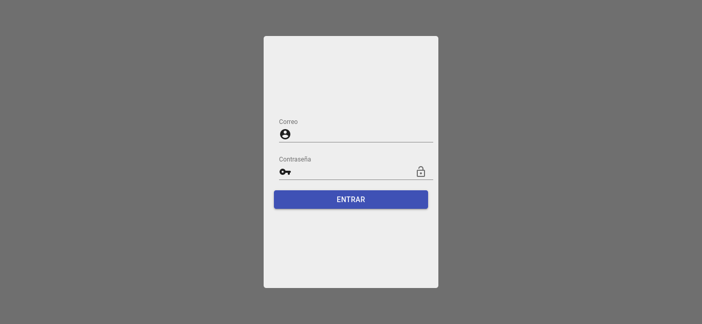
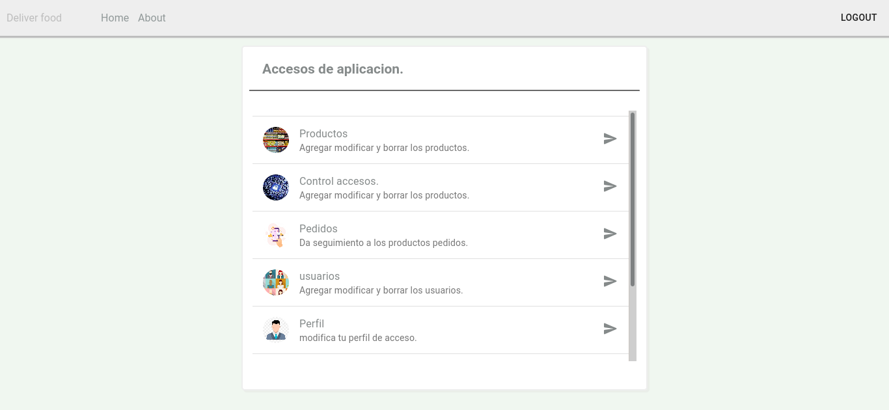
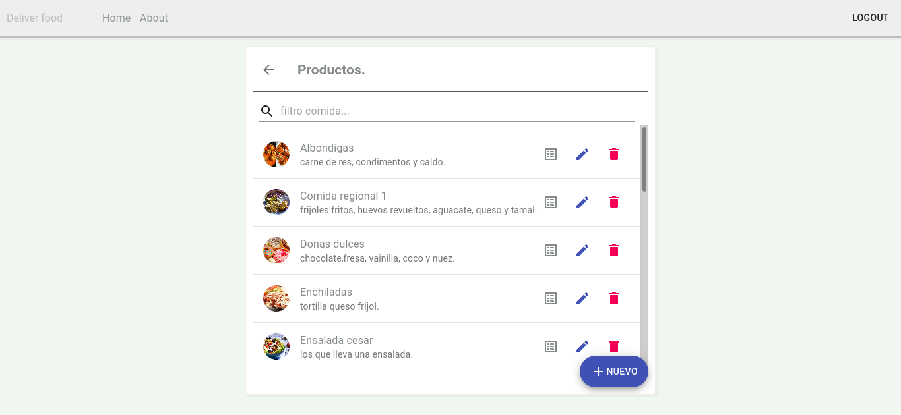
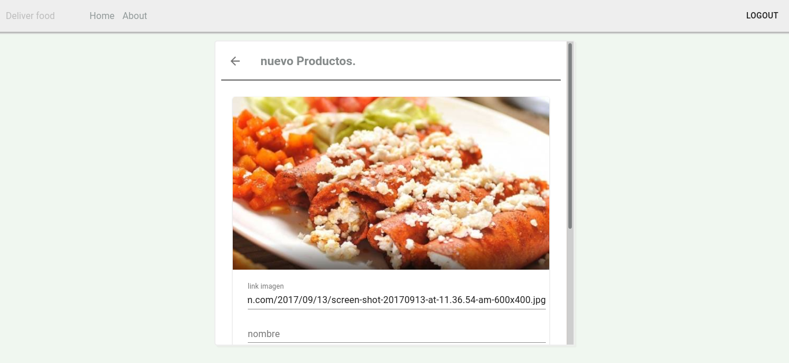
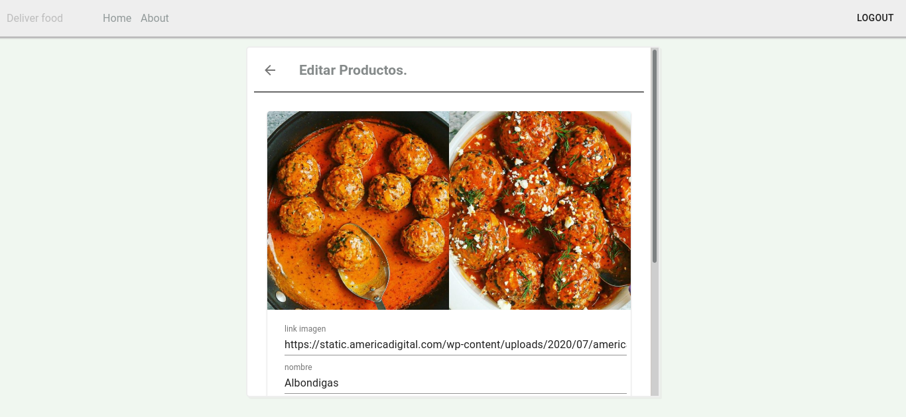
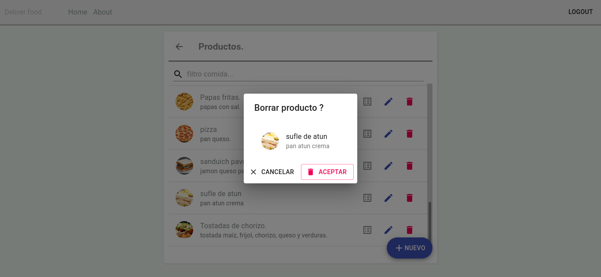
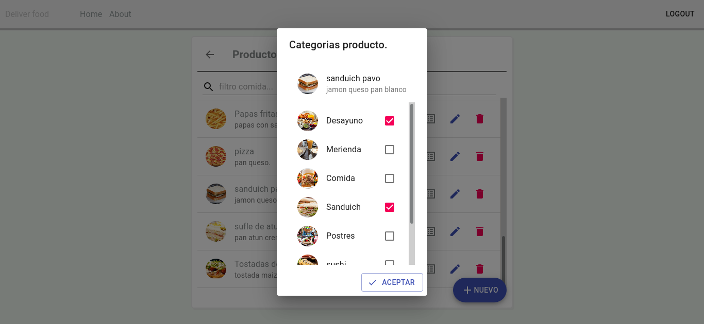

# Proyect name is Deliver food

## this proyect are a system deliver food for customer of a store 

## Start proyect : 
- run back-end with command =>  
 <code> python3 manage.py runserver</code>
  - the back are run in the port 8000.
  - the back use python with framework Django.
- after run front with  =>  
 <code> npm start</code>
  - the front are run in the port 3000.
  - the front run with node/react.

## Usuario default
- email: yo@gmail.com
- passw: 1111

### This application will be for home delivery of food as its name says. 

## Views Pages.

  

  <h3>Login</h3>
  
  

  

  <h3>Home</h3>
  
  

  
  

  <h3>products</h3>
  
  

  

  <h3>New Prod.</h3>
  
  

  
  

  <h3>Edit Prod.</h3>
  
  

  

  <h3>Delete</h3>
  
  

  

  <h3>Categories</h3>
  
  

